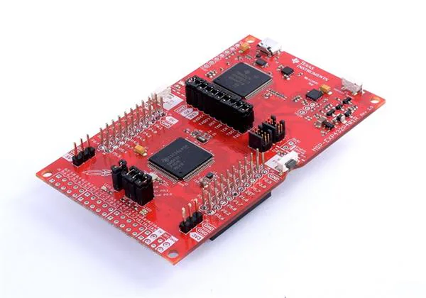
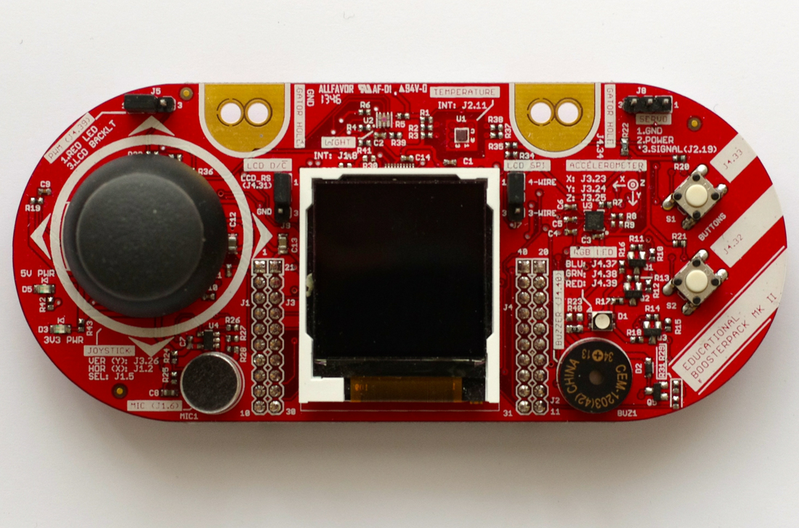

# Embedded Software for the Internet of Things

<h2>What is this repository?</h2>
This repository contains the final project for the course <em>Embedded Software for the Internet of Things</em>, held at the University of Trento by Professor Kasim Sinan Yildirim during the academic year 2024/2025.
  

<h2>What is this project about?</h2>
This project aims to recreate a mini portable retro-style game console using the MSP432P401R development board by Texas Instruments.  
The board is well-suited for this purpose thanks to its integrated peripherals, which include:

- A display  
- Buttons  
- An analog stick  
- A buzzer  
- On-board LEDs

The console is dedicated to recreating **Pong**, an arcade-inspired game that captures the iconic style and simplicity of 1970s gaming.
  

### Pong
Pong leverages both the left analog stick and the two right-side buttons on the MSP432 board. The paddle (i.e., the vertical bar that players move to hit the ball) can be controlled using either input method, supporting intuitive "UP" and "DOWN" movements.

- **Single Player Mode**: Play against a basic CPU opponent.  
- **Two Player Mode**: Challenge a friend using shared controls.  

This setup allows for both accessible gameplay and a faithful recreation of the original arcade experience.

This project combines embedded systems programming with retro game design to deliver a fun and educational hands-on application of the MSP432 platform.
  

<h2>Hardware Platform</h2>
This project has been developed for the MSP432P401R board and the BoosterPack MKII by Texas Instruments. 
Hardware-dependent code is isolated in its own folder so that porting to other platforms does not require rewriting the application logic.
  

  <table>
    <tr>
      <td align="center">
         
        <b>MSP432P401R LaunchPad</b>
      </td>
      <td align="center">
         
        <b>BoosterPack MKII</b>
      </td>
    </tr>
  </table>

  

<h2>Tools Used</h2>
Code Composer Studio has been used for developing, uploading the software to the platform, and debugging. 
Specifically, we used <b>Code Composer Studio version 12.7.0</b> to ensure full compatibility with the MSP432P401R board and the libraries provided in the MSP432 SDK. 
While other versions of CCS might also work, we recommend using <b>version 12.7.0</b> to avoid potential compatibility issues with the hardware or software dependencies adopted in this project.
  

<h2>Project Layout</h2>
This section describes the folder and file structure of the project.
<pre>
.
├── .settings
│   ├── org.eclipse.cdt.codan.core.prefs
│   ├── org.eclipse.cdt.debug.core.prefs
│   └── org.eclipse.core.resources.prefs
├── .vscode
│   └── c_cpp_properties.json
├── LcdDrivers
│   ├── Crystalfontz128x128_ST7735.c
│   ├── Crystalfontz128x128_ST7735.h
│   ├── HAL_MSP_EXP432P401R_Crystalfontz128x128_ST7735.c
│   └── HAL_MSP_EXP432P401R_Crystalfontz128x128_ST7735.h
├── css
│   ├── startup_msp432p401r_ccs.c
│   └── system_msp432p401r.c
├── images
│   ├── MSP432P401R.png
│   └── booster_pack.png
├── src
│   ├── HWdependent        # Files for hardware components
│   │   ├── display.c
│   │   ├── display.h
│   │   ├── hw_init.c
│   │   ├── hw_init.h
│   │   ├── joystick.c
│   │   ├── joystick.h
│   │   ├── pcm.c
│   │   └── pcm.h
│   ├── buzzer.c          # Plays music
│   ├── buzzer.h
│   ├── end_game.c        # End game screen
│   ├── end_game.h
│   ├── main.c            # Entry point
│   ├── main.h
│   ├── menu.c            # Game mode selection
│   ├── menu.h
│   ├── pause.c           # Pause screen logic
│   ├── pause.h
│   ├── pong.c            # Game state machine
│   └── pong.h
├── targetConfigs
│   ├── MSP432P401R.ccxml
│   └── readme.txt
├── .cssproject
├── .cproject
├── .gitignore
├── .project
├── README.md
└── msp432p401r.cmd
</pre>
 

<h2>How to Make the Project Work</h2>
<!-- Qui va completata la sezione con istruzioni passo passo su come importare, compilare e caricare il progetto in CCS -->
Explain how to import the project into Code Composer Studio, how to resolve any dependencies, and how to compile and upload the firmware to the board.
  

<h2>Team Members</h2>
<ul>
  <li>Lorenzo Cortese</li>
  <li>Matteo Cornacchia</li>
  <li>Matteo Ferrari</li>
</ul>
